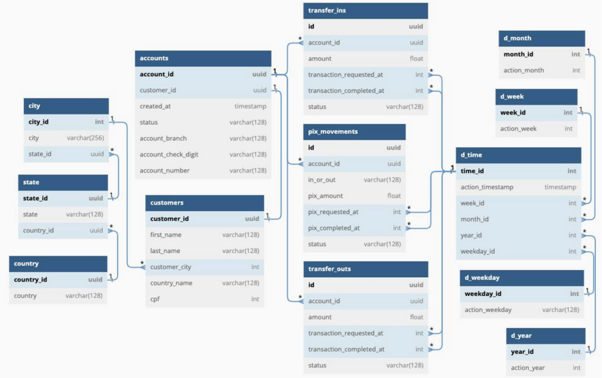

# Data + Business Analyst

## SQL Projects

## <ins>Fintech Case</ins>

**Problem Statement:**

Your colleague, Jane Hopper, the Business Analyst responsible for analysing customer behaviour and directly consuming data from the Data Warehouse Environment, needs to obtain all Monthly Account Balances in 2020.
She was unable to do this on her own and has asked for your help in creating the necessary SQL query.

**Business Context:**

The Monthly Account Balance is the amount of money a customer had in their account at the end of a given month. This information can be calculated by:
Adding all received amounts (inflow transactions).
Subtracting all sent amounts (outflow transactions).
Adding or subtracting the accumulated balance from the previous month.

**Expected result:**


**Tables relationship diagram:**



**Solution:**

**Expected final result columns:**
- Month
- Customer
- Total_Transfer_in (pix.movements > pix_in (in_or_out) + tranfers_in)
- Total_Transfer_out (pix.movements > pix_out (in_or_out) + tranfers_out)
- Acc_Monthly_Balance

**Tables needed:**
- transfer_ins, transfer_outs, pix_movements (to calculate total transfer)
- customer (to get customer name)
- accounts (to connects customers table to transfer tables)
- time (to get dates)

**SQL Query:**

Exploring possible status for accounts:
```sql
SELECT
    DISTINCT(status)
FROM `case-fintech.case_study_fintech.accounts`;
```
Check if customer can have more than one account:
```sql
SELECT
    customer_id,
    COUNT (account_id)
FROM `case-fintech.case_study_fintech.accounts`
GROUP BY customer_id
HAVING COUNT (account_id) > 1;
```
Create a table to unify transfer_ins, transfer_outs and pix_movements:

```sql
CREATE OR REPLACE TABLE `case-fintech.case_study_fintech.all_transfers` AS
(SELECT 
    mv.id AS transfer_id, 
    CONCAT (ct.first_name,' ',ct.last_name) AS name, -- Concatenate first and last name to get full name
    mv.pix_amount AS amount, -- Renaming to allow UNION with other queries
    tm.action_timestamp AS transaction_completed_at, 
    EXTRACT (MONTH FROM TIMESTAMP (tm.action_timestamp)) AS month, -- Gets month
    EXTRACT (YEAR FROM TIMESTAMP (tm.action_timestamp)) AS year, -- Gets year. In this case all data is from 2020, but thinking of further analyses, it's useful to get the year as well.
    CASE mv.in_or_out WHEN "pix_in" THEN "transfer_in" ELSE "transfer_out" END AS in_or_out -- Renaming to facilitate PIVOT further ahead
FROM `case-fintech.case_study_fintech.pix_movements` mv
LEFT JOIN `case-fintech.case_study_fintech.time` tm ON mv.pix_completed_at = tm.time_id -- Get date in timestamp
LEFT JOIN `case-fintech.case_study_fintech.accounts` ac ON mv.account_id = ac.account_id -- Connects Customers table with Pix_movements
LEFT JOIN `case-fintech.case_study_fintech.customers` ct ON ac.customer_id = ct.customer_id -- Get customer name
WHERE mv.status = "completed" AND ac.status = 'active' -- Remove incomplete transactions and inactive accounts

UNION ALL

SELECT 
    ti.id AS transfer_id, 
    CONCAT (ct.first_name,' ',ct.last_name) AS name,
    ti.amount,
    tm.action_timestamp AS transaction_completed_at,
    EXTRACT (MONTH FROM TIMESTAMP (tm.action_timestamp)) AS month,
    EXTRACT (YEAR FROM TIMESTAMP (tm.action_timestamp)) AS year,
    "transfer_in" AS in_or_out
FROM `case-fintech.case_study_fintech.transfer_ins` ti
LEFT JOIN `case-fintech.case_study_fintech.time` tm ON ti.transaction_completed_at = tm.time_id
LEFT JOIN `case-fintech.case_study_fintech.accounts` ac ON ti.account_id = ac.account_id
LEFT JOIN `case-fintech.case_study_fintech.customers` ct ON ac.customer_id = ct.customer_id
WHERE ti.status = "completed" AND ac.status = 'active'

UNION ALL

SELECT 
    tu.id AS transfer_id, 
    CONCAT (ct.first_name,' ',ct.last_name) AS name,
    tu.amount,
    tm.action_timestamp AS transaction_completed_at,
    EXTRACT (MONTH FROM TIMESTAMP (tm.action_timestamp)) AS month,
    EXTRACT (YEAR FROM TIMESTAMP (tm.action_timestamp)) AS year,
    "transfer_out" AS in_or_out
FROM `case-fintech.case_study_fintech.transfer_outs` tu
LEFT JOIN `case-fintech.case_study_fintech.time` tm ON tu.transaction_completed_at = tm.time_id
LEFT JOIN `case-fintech.case_study_fintech.accounts` ac ON tu.account_id = ac.account_id
LEFT JOIN `case-fintech.case_study_fintech.customers` ct ON ac.customer_id = ct.customer_id
WHERE tu.status = "completed" AND ac.status = 'active'
);
```

Query to check it there's data from different years:
```sql
SELECT *
FROM `case-fintech.case_study_fintech.all_transfers`
WHERE year <> 2020;
```
Query to PIVOT data from rows to columns and calculate monthly balance:
```sql
WITH pivot_table AS
(SELECT 
    name, 
    month, 
    COALESCE((transfer_in),0) AS transfer_in, 
    COALESCE((transfer_out),0) AS transfer_out
FROM 
    (SELECT name, month, amount, in_or_out FROM `case-fintech.case_study_fintech.all_transfers`)
    PIVOT (SUM(amount) FOR in_or_out IN ('transfer_in', 'transfer_out'))
)

SELECT 
    month AS Month, 
    name AS Customer, 
    ROUND(transfer_in,2) AS Total_Transfer_in, 
    ROUND(transfer_out,2) AS Total_Transfer_out, 
    ROUND(SUM(transfer_in - transfer_out) OVER (PARTITION BY name ORDER BY month), 2) AS Acc_Monthly_Balance
FROM pivot_table
ORDER BY 2,1;
```
**Output:**


